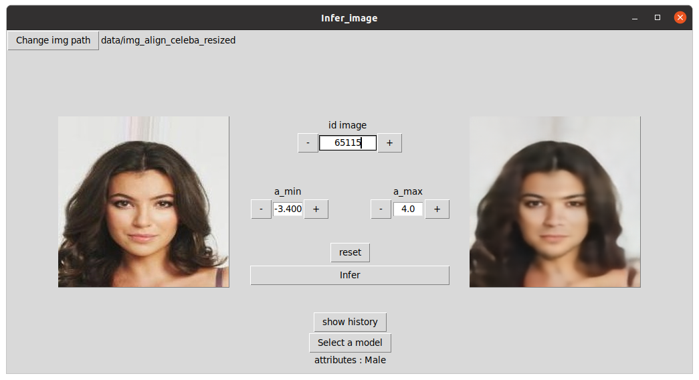

# Projet FaderNetwork

Tensorflow implementation of Fader Network https://arxiv.org/pdf/1706.00409.pdf

## 1. Dependencies
Tensorflow
OpenCV

## 2. Installation

First of all you need to clone the repository:
```bash
git clone https://github.com/Huss94/FaderNetwork_MLA.git
cd FaderNetwork_MLA
```

The next step is to download the dataset. Go to http://mmlab.ie.cuhk.edu.hk/projects/CelebA.html and download the Allign and Crop CelebA Dataset which contain all the images
Extract the images and move them to `data/img_align_celeba/` 
Download the attributes annotations and move it to `data/list_attr_celeba.txt/` 

Preprocess the data with the command : 
```bash
./preprocess.py

#Default arguments are
--img_path "data/img_align_celeba" #Where the images are
--img_save_path "data/img_align_celeba_resized"  # Where the resized image will be saved
--attr_path "data/list_attr_celeba.txt" #Where the att_list is 
--attr_save_path "data/attributes.npz" #Where the processed list will be saved 
```

We could give to the network not preprocessed (not resized) images, but it would be longer.

if you have a good connection and wan't to jump the preprocessing, you can download our preprocessed images and attributes at :
https://drive.google.com/drive/folders/1ylbeY9PZBJTggGF_3PlmKEPIZds2Q-e-?usp=sharing

By downloading `img_align_celeba_resized` and `attributes.npz` and placing them into the `data` folder


## 3. Classifier

First of all we need to train a classifier. The classifier isn't necessary to train a Fader model but it helps to save the best model.</br>
(As the classifier isn't involved in the training of the fader, this step is optional)

You can download a trained classifier here on our drive :https://drive.google.com/drive/folders/1ylbeY9PZBJTggGF_3PlmKEPIZds2Q-e-?usp=sharing

to train a classifier you need to execute the following command :
All the arguments given below are defaults.


```bash
./clasifier.py

# Path to images
--img_path "data/img_align_celeba_resized" 

# Indique où enrisitrer le model
--save_path "models"

# path to attributes
--attr_path "data/attributes.npz"

# Size of the batch used during the training
--batch_size 32

# Batch size for the evaluation little number for memory constraint
--eval_bs 20 

# Considered attributes to train the network with
--attr "*"

# Numbers of epochs
--n_epoch 5

# Number of images seen at each epoch
--epoch_size 50000

# Number of images in the dataset 
--n_images 202599

# 2 values : 'preprocessed' or 'direct'. from what the data are loaded npz file or direct data
--loading_mode 'direct'

# Should the program load all the data in RAM for training ?
--load_in_ram 0

# If we already trained a model and wan't to continue the training, inform the path to the classifier model folder 
--model_path ''
```


## 4. Fader Network training
It is now time to train our model. To do so, use the following command :
All the arguments given below are defaults.

```bash
./train.py

# Path to images
--img_path "data/img_align_celeba_resized" 

# Indique où enrisitrer le model
--save_path "models"

# path to attributes
--attr_path "data/attributes.npz"

# Size of the batch used during the training
--batch_size 32

# Batch size for the evaluation, little number for low memory system
--eval_bs 20 

# Considered attributes to train the network with
--attr "Male"

# Numbers of epochs
--n_epoch 5

# Horizontal flip, data augmentation, 1 pour activer
--h_flip 0

# Horizontal flip, data augmentation, 1 pour activer
--v_flip 0

# Number of images seen at each epoch
--epoch_size 50000

# Number of images in the dataset 
--n_images 202599

# 2 values : 'preprocessed' or 'direct'. from what the data are loaded npz file or direct data
--loading_mode 'direct'

# Should the program load all the data in RAM for training ?
--load_in_ram 0


# If we want to continue the training, inform the path of the "Fader_backup" folder
--model_path ''

# Classifier path to classifier folder (optional) exemple : models/classifier
--classifier_path ''
```

It will generate 3 directory in models/Male

 - Ae_best_loss
 - Ae_best_acc
 - Fader_backup

Fader_backup is used to take back training
Ae_best_loss is used for inferation,  it's an AutoEncoder that had the best reconstruction loss
Ae_best_acc is the AutoEncoder model that had the best accuracy given by the classifier

## 5. Use the fader network

We propose you a little python program to use the fader network. (another method is given below)</br>
you can use the following command.
All the arguments given below are defaults.

```bash
./use_fader.py

# Path to the model we want to infer with. It has to be an AutoEncoder 
# Exemple : models/Young/Ae_best_loss
--model_path ""

# Path to images
--img_path "data/img_align_celeba_resized" 

# path to attributes
--attr_path "data/attributes.npz"

# Number of images to infer
--n_images_to_infer 10

# Number of alphas
--n_alphas


# Should the program load all the data in RAM for training ?
--load_in_ram 0

# Number of images in the dataset
--n_images 202599


# Path to the folder in which we save the image created
--save_path images

# Minimum value for attributes in form [alpha_min, alpha_max]
--alpha_min 0

# maximum value for attributes in form [alpha_min, alpha_max]
--alpha_max 1

# Define if we take random images to infer in the test dataset
# if random_ind = 0, we take the first images in the test dataset + the offset
--random_ind RANDOM_IND

# Offset the test dataset
--offset 0

# List of indices of images in the dataset, ex : 5,1,2,1561,4564,31
--indices ""

```


## 6. Use our gui

We provide you with a gui to make inferation of the model.
it allows to control the y attributes [a_min, a_max] we give in the decoder and see the change on the image directly



to use it, use the following command
```bash
python gui.py
```
